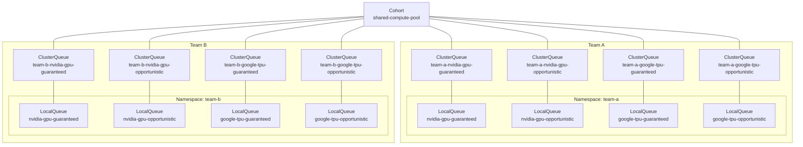

In multi-tenant accelerator clusters, a single team often needs two different scheduling contracts:

1. **Guaranteed capacity** for workloads that must run within secured team quota.
2. **Opportunistic capacity** for workloads that can use idle cluster resources but can tolerate preemption.

A practical way to model this is to create separate `ClusterQueue`s per team, accelerator family, vendor, and scheduling contract.

Use the following naming pattern for `ClusterQueue`s:

```text
<team-name>-<accelerator-vendor>-<accelerator>-guaranteed
<team-name>-<accelerator-vendor>-<accelerator>-opportunistic
```

For example:

```text
team-a-nvidia-gpu-guaranteed
team-a-nvidia-gpu-opportunistic
team-a-amd-gpu-guaranteed
team-a-amd-gpu-opportunistic
team-a-google-tpu-guaranteed
team-a-google-tpu-opportunistic
```

This design is inspired by the `ClusterQueue` separation model discussed in [Batch Systems in Production with Kueue: Multi-Tenancy and Fungibility](https://www.youtube.com/watch?v=cEnor-oW9_s&t=1359s).

## Accelerator family and queue separation

In heterogeneous accelerator clusters, accelerator families can have different resource names, runtime stacks, operators, node pools, and scheduling policies. For example, NVIDIA GPUs, AMD GPUs, Google TPUs, and future NPUs may not be interchangeable even if they are all accelerators.

The important scheduling detail is that accelerator workloads do not consume the accelerator alone. They also consume the CPU, memory, and pod capacity of the same accelerator node pool.

Kueue’s `resourceGroup` model is a good fit for this. When a `ResourceFlavor` represents a node group, machine family, or VM availability policy, the resources associated with those nodes should usually be assigned to the same flavor during admission. For accelerator nodes, that means CPU, memory, pods, and the accelerator resource should be accounted together.

For that reason, this design uses separate `ClusterQueue`s and `LocalQueue`s for each heterogeneous accelerator family. Each queue family can then define a clean `resourceGroup` where the node-associated resources are grouped together:

```text
cpu
memory
pods
<accelerator resource>
```

For example, an NVIDIA GPU queue can account for:

```text
cpu
memory
pods
nvidia.com/gpu
```

while an AMD GPU queue can account for:

```text
cpu
memory
pods
amd.com/gpu
```

This avoids mixing different accelerator backends in a single user-facing queue and avoids ambiguous quota accounting for CPU and memory across incompatible node pools.

The queue boundary represents the user-facing capacity contract and the runtime compatibility boundary:

```text
ClusterQueue   = team + accelerator vendor + accelerator type + contract
LocalQueue     = accelerator vendor + accelerator type + contract
ResourceFlavor = model, topology, node pool, or cost variation
```



For example, `team-a-nvidia-gpu-guaranteed` can contain multiple NVIDIA GPU `ResourceFlavor`s, such as H100, H200, or L40S. Those model-level differences should stay in `ResourceFlavor`s rather than becoming separate `ClusterQueue`s.

```text
team-a-nvidia-gpu-guaranteed
  - nvidia-h100-sxm-2x4-ib-ndr-400g-amd64-onprem
  - nvidia-h200-sxm-2x4-ib-ndr-400g-amd64-onprem
  - nvidia-l40s-pcie-amd64-onprem
```

If a different accelerator family is introduced, such as AMD GPU, Google TPU, or NVIDIA NPU, it should use its own queue family:

```text
team-a-amd-gpu-guaranteed
team-a-amd-gpu-opportunistic
team-a-google-tpu-guaranteed
team-a-google-tpu-opportunistic
team-a-nvidia-npu-guaranteed
team-a-nvidia-npu-opportunistic
```

This keeps scheduling behavior aligned with the actual node pools. CPU, memory, pod capacity, and accelerator quota are assigned from the same flavor, while `ResourceFlavor` still handles model-level differences inside the same accelerator family.

In short:

```text
Separate queues by accelerator family and runtime compatibility.
Use ResourceFlavor for model, topology, node pool, and cost differences.
Keep node-associated resources in the same resourceGroup.
```

## What to manage with ResourceQuota and ClusterQueue

This design uses `ResourceQuota` and `ClusterQueue` for different quota decisions.

`ClusterQueue` manages resources that Kueue evaluates during Workload admission:

```text
ClusterQueue:
- cpu
- memory
- pods
- accelerator resources such as nvidia.com/gpu
```

`ResourceQuota` remains responsible for Kubernetes API object count quotas in a namespace:

```text
ResourceQuota:
- persistentvolumeclaims
- configmaps
- secrets
- services
- other object count quotas
```

The key distinction is whether the item is evaluated during Kueue Workload admission.

Kueue calculates Workload quota usage from PodSet resource requests and PodSet count. CPU, memory, and accelerator resources come from the Pod template's resource requests. `pods` is different: it is not specified in Pod resource requests, but it is a Kueue-reserved resource name that can be used in `ClusterQueue` to limit the number of admitted Pods.

Therefore, CPU, memory, pods, and accelerator resources should be managed in `ClusterQueue` because they are part of Kueue's admission and quota reservation decision.

PVCs, ConfigMaps, Secrets, and Services are different. They may be used by workloads, but they are Kubernetes API objects, not resources that Kueue evaluates as Workload quota usage. Therefore, they should remain in `ResourceQuota` as object count quotas instead of being managed by `ClusterQueue`.

## Guaranteed ClusterQueue strategy

The **Guaranteed ClusterQueue** represents the team’s secured entitlement.

It is intended for workloads that should run predictably within the quota assigned to the team. In this strategy, guaranteed queues usually do **not borrow** from other queues by default. This makes the queue easier to reason about: if a workload is admitted through the guaranteed queue, it is running against the team’s own reserved capacity.

At the same time, unused guaranteed quota can still be shared with other queues through `lendingLimit`. This allows the cluster to stay highly utilized without weakening the team’s entitlement.

### Example

```yaml
apiVersion: kueue.x-k8s.io/v1beta2
kind: ClusterQueue
metadata:
  name: team-a-nvidia-gpu-guaranteed
spec:
  cohortName: shared-compute-pool

  namespaceSelector:
    matchLabels:
      example.com/managed-by-kueue: "true"

  queueingStrategy: BestEffortFIFO

  preemption:
    reclaimWithinCohort: Any
    withinClusterQueue: Never

  flavorFungibility:
    whenCanBorrow: TryNextFlavor
    whenCanPreempt: MayStopSearch

  resourceGroups:
  - coveredResources:
    - cpu
    - memory
    - pods
    - nvidia.com/gpu
    flavors:
    - name: nvidia-h100-sxm-2x4-ib-ndr-400g-amd64-onprem
      resources:
      - name: cpu
        nominalQuota: "60"
        borrowingLimit: "0"
        lendingLimit: "0"
      - name: memory
        nominalQuota: "256Gi"
        borrowingLimit: "0"
        lendingLimit: "0"
      - name: pods
        nominalQuota: "30"
        borrowingLimit: "0"
        lendingLimit: "0"
      - name: nvidia.com/gpu
        nominalQuota: "30"
        borrowingLimit: "0"
        lendingLimit: "15"
```

### Policy explanation

This policy expresses the following behavior:

* Guaranteed workloads run within secured team quota.
* `namespaceSelector` uses `example.com/managed-by-kueue: "true"` as a coarse guardrail. [This label marks namespaces that are managed by the Kueue administrator for admission through Kueue](https://kueue.sigs.k8s.io/docs/tasks/manage/enforce_job_management/opt_in_namespace_management/). The goal is not to encode every `ClusterQueue` permission in namespace labels, but to prevent workloads from unmanaged namespaces from being admitted accidentally. Users are not granted permission to create, update, or delete `LocalQueue`s directly. Instead, `LocalQueue`s are created and managed by the platform through Argo CD, so access to a specific `ClusterQueue` is controlled by the platform-managed GitOps workflow.
* To keep scheduling simple, only idle GPU quota is shared through `lendingLimit`; CPU and memory are kept as supporting quota for the guaranteed queue.
* `borrowingLimit: "0"` prevents the guaranteed queue from depending on borrowed resources.
* `lendingLimit` allows idle quota to be shared with other queues in the same cohort.
* `reclaimWithinCohort: Any` allows guaranteed workloads to reclaim quota that was temporarily borrowed by other queues.
* `withinClusterQueue: Never` prevents workloads inside the same guaranteed queue from preempting each other.
* `pods` quota acts as a concurrency and fragmentation guard. It is useful not only for capacity accounting, but also to discourage a pattern where users submit many tiny Pods to occupy scheduler slots or bypass the intended workload shape.

In short, this queue is optimized for **predictability first**, while still allowing unused capacity to contribute to overall cluster utilization.

### Suitable workloads

The guaranteed strategy is a good fit for:

* Production serving workloads.
* Training jobs that require secured accelerator quota.
* Time-sensitive workloads with predictable capacity requirements.
* Team-level quota guarantees.
* Workloads where unexpected preemption would be expensive or operationally risky.

## Opportunistic ClusterQueue strategy

The **Opportunistic ClusterQueue** represents idle-capacity usage.

It is intended for workloads that should run when the cluster has spare resources, but should not own guaranteed accelerator quota. Opportunistic workloads can improve utilization significantly, especially in heterogeneous accelerator environments where different teams may leave different accelerator types idle at different times.

Unlike the guaranteed queue, the opportunistic queue usually has `nominalQuota: "0"` for scarce accelerator resources. This makes the policy explicit: opportunistic workloads are admitted by using borrowed idle capacity, not by consuming a team entitlement.

### Example

```yaml
apiVersion: kueue.x-k8s.io/v1beta2
kind: ClusterQueue
metadata:
  name: team-a-nvidia-gpu-opportunistic
spec:
  cohortName: shared-compute-pool

  namespaceSelector:
    matchLabels:
      example.com/managed-by-kueue: "true"

  queueingStrategy: BestEffortFIFO

  admissionScope:
    admissionMode: UsageBasedAdmissionFairSharing

  preemption:
    reclaimWithinCohort: Never
    withinClusterQueue: Never

  flavorFungibility:
    whenCanBorrow: TryNextFlavor
    whenCanPreempt: TryNextFlavor

  resourceGroups:
  - coveredResources:
    - cpu
    - memory
    - pods
    - nvidia.com/gpu
    flavors:
    - name: nvidia-h100-sxm-2x4-ib-ndr-400g-amd64-onprem
      resources:
      - name: cpu
        nominalQuota: "120"
        borrowingLimit: "0"
        lendingLimit: "0"
      - name: memory
        nominalQuota: "512Gi"
        borrowingLimit: "0"
        lendingLimit: "0"
      - name: pods
        nominalQuota: "30"
        borrowingLimit: "0"
        lendingLimit: "0"
      - name: nvidia.com/gpu
        nominalQuota: "0"
        borrowingLimit: "16"
        lendingLimit: "0"
```

### Policy explanation

This policy makes opportunistic workloads useful, but clearly preemptible:

* Opportunistic workloads can use idle accelerator capacity.
* `namespaceSelector` uses `example.com/managed-by-kueue: "true"` as a coarse guardrail. [This label marks namespaces that are managed by the Kueue administrator for admission through Kueue](https://kueue.sigs.k8s.io/docs/tasks/manage/enforce_job_management/opt_in_namespace_management/). The goal is not to encode every `ClusterQueue` permission in namespace labels, but to prevent workloads from unmanaged namespaces from being admitted accidentally. Users are not granted permission to create, update, or delete `LocalQueue`s directly. Instead, `LocalQueue`s are created and managed by the platform through Argo CD, so access to a specific `ClusterQueue` is controlled by the platform-managed GitOps workflow.
* To keep scheduling simple, CPU and memory have their own positive `nominalQuota`, while only GPU is treated as borrowed opportunistic capacity.
* `nominalQuota: "0"` makes it clear that this queue does not own guaranteed accelerator quota.
* `borrowingLimit` caps how much idle cohort capacity this queue can consume.
* `reclaimWithinCohort: Never` prevents opportunistic workloads from reclaiming resources from other queues.
* Guaranteed workloads can reclaim their quota from opportunistic workloads when needed.
* `withinClusterQueue: Never` avoids preemption between workloads submitted to the same opportunistic queue.
* `UsageBasedAdmissionFairSharing` helps distribute idle capacity fairly when multiple users or namespaces submit to the same opportunistic queue.
* `pods` quota is still useful even when accelerator quota is opportunistic. It limits the number of admitted Pods and helps prevent the cluster from being filled with many very small Pods that consume scheduling capacity inefficiently.

In short, this queue is optimized for **utilization first**, while preserving the right of guaranteed queues to reclaim their secured quota.

### Suitable workloads

The opportunistic strategy is a good fit for:

* Interruptible training jobs.
* Batch inference jobs.
* Development and experimentation workloads.
* Hyperparameter sweeps that can tolerate preemption.
* Low-priority research workloads.
* Workloads where higher cluster utilization is more important than strict completion-time guarantees.

It is usually not a good fit for production serving, deadline-sensitive jobs, or workloads with very high checkpoint/restart cost.

## Preemption and borrowed capacity policy

This design uses **Classic Preemption** as the default instead of enabling Preemption-based Fair Sharing immediately.

The main reason is workload stability.

This cluster is expected to run a mix of workload types, including:

```text
- large-scale distributed training
- opportunistic batch workloads
- LLM serving workloads
- LWS-based serving workloads
```

In this environment, preemption can be expensive. Preempting a large training job can waste GPU-hours if the job has not checkpointed recently. Preempting an LLM serving workload can trigger model reloads, worker restarts, warmup, and readiness recovery.

Because of that, the default preemption policy should be easy for users to understand and should avoid unnecessary disruption.

### Why Classic Preemption is the default

Classic Preemption matches the guaranteed/opportunistic queue model naturally.

```text
guaranteed queue    = owns nominal quota
opportunistic queue = uses idle or borrowed capacity
```

With Classic Preemption, preemption happens mainly when:

```text
- a guaranteed queue needs to reclaim its nominal quota
- a higher-priority workload needs capacity according to the configured policy
```

This gives users a clearer contract:

```text
opportunistic workloads may be preempted when guaranteed quota must be reclaimed.
```

That is expected behavior for opportunistic usage.

For example:

```text
team-a-nvidia-gpu-guaranteed owns 32 GPUs.
team-b-nvidia-gpu-opportunistic is temporarily borrowing idle GPUs.
team-a-nvidia-gpu-guaranteed submits a workload that needs its quota back.
team-b-nvidia-gpu-opportunistic may be preempted so team-a-nvidia-gpu-guaranteed can reclaim its quota.
```

This is easier to explain because the preemption is tied to quota ownership.

### Why not Preemption-based Fair Sharing by default?

Preemption-based Fair Sharing is useful when the cluster wants to actively rebalance borrowed capacity across `ClusterQueue`s.

However, it changes the meaning of preemption.

With Preemption-based Fair Sharing enabled, a workload may be preempted not only because a guaranteed queue needs to reclaim quota, but also because Kueue is trying to move the cohort closer to equal or weighted fair share.

For example:

```text
team-a-nvidia-gpu-opportunistic is running a large training workload using many borrowed GPUs.
team-b-nvidia-gpu-opportunistic later submits a workload.
Kueue sees that team-a has a high share.
Kueue may preempt team-a's workload to rebalance fair share.
```

This can be correct from a fairness perspective, but it can be disruptive from the user's perspective.

The key difference is:

```text
Classic Preemption:
- mainly quota-reclaim or priority driven
- easier to explain to users
- better aligned with guaranteed vs opportunistic queue contracts

Preemption-based Fair Sharing:
- can also preempt for fair-share rebalancing
- may interrupt large borrowed-capacity workloads even when no guaranteed quota is being reclaimed
- better suited when the cluster is ready to tolerate fair-share-driven preemption
```

For small, checkpointable, interruptible workloads, that trade-off may be acceptable.

For large training workloads or LLM serving workloads, it can be too disruptive as a default policy.

### Resource monopolization guardrails

Choosing Classic Preemption still requires explicit guardrails so that one `ClusterQueue` does not consume shared GPU capacity for too long or at too large a scale.

This design uses three simple controls:

```text
borrowingLimit:
- caps how much idle cohort capacity a ClusterQueue can borrow

maximumExecutionTimeSeconds:
- limits how long an opportunistic workload can run

Admission Fair Sharing:
- improves admission fairness without preempting running workloads
```

## Admission Fair Sharing policy

Admission Fair Sharing is useful when multiple `LocalQueue`s or users share a single opportunistic `ClusterQueue`.

For example:

```text
team-a-nvidia-gpu-opportunistic
  <- user-a/nvidia-gpu-opportunistic
  <- user-b/nvidia-gpu-opportunistic
  <- user-c/nvidia-gpu-opportunistic
```

In this case, users are competing for idle capacity. Historical usage should influence admission order so that one user does not continuously dominate the opportunistic pool.

This section focuses on how to choose the values in `admissionFairSharing`. These values define how historical usage is measured, how quickly old usage decays, and how strongly each resource contributes to the usage score.

A practical approach is to make the usage score cost-aware. OpenCost's AWS pricing configuration provides default allocation values for CPU, RAM, GPU, and storage. These values can be used as a starting point for `resourceWeights`, so Admission Fair Sharing accounts not only for how much resource was consumed, but also for the estimated cost of that usage.

A simple cost-oriented starting point is:

```yaml
admissionFairSharing:
  usageHalfLifeTime: "168h"
  usageSamplingInterval: "5m"
  resourceWeights:
    cpu: 0.031611
    memory: 0.004237
    nvidia.com/gpu: 0.95
```

The rationale for each value is:

* `usageHalfLifeTime: "168h"` uses a one-week half-life for historical usage. The policy goal is to balance recent usage and forgiveness. Seven days is long enough to discourage repeated opportunistic overuse within the same week, while still allowing older usage to gradually lose influence so users are not penalized indefinitely.
* `usageSamplingInterval: "5m"` samples usage every five minutes. The policy goal is to capture meaningful accelerator usage frequently enough for fair admission decisions, without making the usage score too noisy for short-lived workload changes.
* `cpu: 0.031611` uses the CPU allocation value from the same OpenCost AWS configuration.
* `memory: 0.004237` uses the RAM allocation value from the same OpenCost AWS configuration.
* `nvidia.com/gpu: 0.95` uses the default GPU allocation value from the OpenCost AWS pricing configuration. This is useful when all GPUs are treated as a single generic GPU resource.

Policy meaning:

```text
Admission Fair Sharing can be based on estimated resource cost.
GPU usage contributes the most because it has the highest cost weight.
CPU and memory usage still matter, but with lower cost-based weights.
Recent usage matters more than old usage because the usage score decays over time.
```

### Model-specific accelerator weights

For heterogeneous accelerator clusters, a single `nvidia.com/gpu` weight is often too coarse. A T4, L4, A10G, L40S, A100, H100, and H200 should not necessarily contribute the same amount to historical usage.

A better approach is to expose accelerator models as separate extended resources and assign each model its own `resourceWeight`.

Use an organization-owned extended resource namespace. In this example, `accelerator.example.com` is used as the platform-defined namespace:

```text
accelerator.example.com/nvidia-t4
accelerator.example.com/nvidia-l4
accelerator.example.com/nvidia-a10g
accelerator.example.com/nvidia-l40s
accelerator.example.com/nvidia-a100-40gb
accelerator.example.com/nvidia-h100-80gb
accelerator.example.com/nvidia-h200-141gb
```

In production, replace `example.com` with a DNS subdomain owned by your organization.

The domain prefix represents the platform-owned accelerator resource namespace:

```text
accelerator.example.com
```

The resource name after the slash describes the vendor and accelerator model:

```text
nvidia-h100-80gb
amd-mi300x
google-tpu-v5e
aws-trn2
```

This avoids using vendor-owned namespaces such as `nvidia.com/a100` or `amd.com/mi300x` for platform-defined accounting resources.

### Estimating model-specific weights

To estimate a model-specific accelerator weight, start from a representative instance type and subtract the non-accelerator portions first.

The examples below use AWS EC2 instance specifications and On-Demand hourly prices to illustrate the calculation method. AWS is used only as a consistent reference dataset for these examples; pricing from another cloud provider could also be used if the same provider, region, and pricing model are applied consistently across all accelerator types.

The instance specifications and prices were referenced from [Vantage Instances](https://instances.vantage.sh/) for the selected AWS region. On-Demand prices were used because they provide a straightforward baseline without commitment-based discounts or variable Spot pricing.

These values are intended to derive relative policy weights. They should not be interpreted as the actual infrastructure cost of an on-premises accelerator cluster.

The basic approximation subtracts the estimated CPU and memory portions from the instance hourly price:

```text
estimated_accelerator_cost_per_instance
= instance_hourly_price
  - (vcpu_count * cpu_weight)
  - (memory_gib * memory_weight)

estimated_accelerator_cost_per_device
= estimated_accelerator_cost_per_instance / accelerator_count
```

Using the OpenCost AWS defaults:

```text
cpu_weight    = 0.031611
memory_weight = 0.004237
```

For instances that include local NVMe instance storage, an optional storage adjustment can also be applied:

```text
estimated_accelerator_cost_per_instance
= instance_hourly_price
  - (vcpu_count * cpu_weight)
  - (memory_gib * memory_weight)
  - (local_instance_store_gib * storage_weight)

estimated_accelerator_cost_per_device
= estimated_accelerator_cost_per_instance / accelerator_count
```

Using the OpenCost AWS storage value:

```text
storage_weight = 0.00005479452
```

This storage adjustment should be treated as a policy approximation. EC2 instance store is included in the instance usage cost and is not billed as a separate line item. However, subtracting an estimated storage portion can avoid assigning too much of a large accelerator instance's bundled local storage value to the accelerator weight.

Do not subtract network egress, NAT gateway traffic, EBS volume cost, or EFA from the EC2 instance hourly price.

OpenCost's AWS configuration includes network and NAT gateway values, but those represent usage-based network costs, not fixed compute resources bundled into the EC2 instance hourly price. EBS is also billed separately from the instance. EFA should not be subtracted either, because it is an optional EC2 networking feature available on supported instances at no additional cost.

### Example residual-cost calculation

For example, if a representative accelerator instance has:

```text
instance_hourly_price = 1.006
vcpu_count            = 4
memory_gib            = 16
local_instance_store  = 250
accelerator_count     = 1
```

Then:

```text
estimated_accelerator_cost
= 1.006
  - (4 * 0.031611)
  - (16 * 0.004237)
  - (250 * 0.00005479452)

= 1.006
  - 0.126444
  - 0.067792
  - 0.013699

= 0.798065
```

So the model-specific weight can be written as:

```yaml
resourceWeights:
  cpu: 0.031611
  memory: 0.004237
  accelerator.example.com/nvidia-a10g: 0.80
```

This value is not an exact billing price. It is a cost-aware policy weight derived from the representative instance price after subtracting estimated CPU, memory, and local storage portions.

### Example model-specific resource weights

Using the same residual-cost method, model-specific weights can be estimated from representative accelerator instances:

```yaml
admissionFairSharing:
  usageHalfLifeTime: "168h"
  usageSamplingInterval: "5m"
  resourceWeights:
    cpu: 0.031611
    memory: 0.004237
    accelerator.example.com/nvidia-k80: 0.52
    accelerator.example.com/nvidia-t4: 0.32
    accelerator.example.com/nvidia-l4: 0.60
    accelerator.example.com/nvidia-a10g: 0.80
    accelerator.example.com/nvidia-l40s: 1.59
    accelerator.example.com/nvidia-v100: 2.55
    accelerator.example.com/nvidia-a100-40gb: 1.70
    accelerator.example.com/nvidia-h100-80gb: 4.83
    accelerator.example.com/nvidia-h200-141gb: 5.86
```

## LocalQueue strategy

Users should submit workloads to `LocalQueue`s, not directly to `ClusterQueue`s.

Because this design separates queues by heterogeneous accelerator family, create LocalQueues using the following naming pattern:

```text
<accelerator-vendor>-<accelerator>-guaranteed
<accelerator-vendor>-<accelerator>-opportunistic
```

For example, in the `team-a` namespace:

```text
nvidia-gpu-guaranteed      -> team-a-nvidia-gpu-guaranteed
nvidia-gpu-opportunistic   -> team-a-nvidia-gpu-opportunistic
amd-gpu-guaranteed         -> team-a-amd-gpu-guaranteed
amd-gpu-opportunistic      -> team-a-amd-gpu-opportunistic
google-tpu-guaranteed      -> team-a-google-tpu-guaranteed
google-tpu-opportunistic   -> team-a-google-tpu-opportunistic
```

Example:

```yaml
---
apiVersion: kueue.x-k8s.io/v1beta2
kind: LocalQueue
metadata:
  namespace: team-a
  name: nvidia-gpu-guaranteed
spec:
  clusterQueue: team-a-nvidia-gpu-guaranteed
---
apiVersion: kueue.x-k8s.io/v1beta2
kind: LocalQueue
metadata:
  namespace: team-a
  name: nvidia-gpu-opportunistic
spec:
  clusterQueue: team-a-nvidia-gpu-opportunistic
```

This keeps the user-facing contract explicit:

```text
nvidia-gpu-guaranteed    = secured NVIDIA GPU quota
nvidia-gpu-opportunistic = idle NVIDIA GPU capacity, may be preempted
amd-gpu-guaranteed       = secured AMD GPU quota
amd-gpu-opportunistic    = idle AMD GPU capacity, may be preempted
```

## Recommended baseline

```text
ClusterQueue naming:
- <team-name>-<accelerator-vendor>-<accelerator>-guaranteed
- <team-name>-<accelerator-vendor>-<accelerator>-opportunistic

LocalQueue naming:
- <accelerator-vendor>-<accelerator>-guaranteed
- <accelerator-vendor>-<accelerator>-opportunistic

Queue separation:
- use separate ClusterQueues and LocalQueues for each heterogeneous accelerator family
- keep node-associated resources in the same resourceGroup
- use ResourceFlavors for model, topology, node pool, or cost differences within the same accelerator family

Guaranteed:
- nominalQuota > 0 for scarce accelerator resources
- borrowingLimit: 0
- lendingLimit: set based on how much idle accelerator quota can be shared
- queueingStrategy: BestEffortFIFO for mixed training and serving
- reclaimWithinCohort: Any
- withinClusterQueue: Never
- Admission Fair Sharing: off by default, enable only when needed
- pods quota: set as a guardrail against excessive tiny-Pod submissions

Opportunistic:
- nominalQuota: 0 for scarce accelerator resources
- borrowingLimit: set a bounded cap for the accelerator resource
- CPU/memory: positive nominalQuota as supporting resources
- queueingStrategy: BestEffortFIFO
- reclaimWithinCohort: Never
- withinClusterQueue: Never
- Admission Fair Sharing: enabled when multiple LocalQueues or users share the queue
- maximumExecutionTimeSeconds: required
- pods quota: set to limit concurrency and reduce scheduler fragmentation

Admission Fair Sharing:
- use cost-aware resourceWeights
- start with generic vendor resource names only if accelerators can be treated equally
- use model-specific extended resources when accelerator models have different cost, scarcity, or business value
- use this for non-preemptive fairness between LocalQueues

LocalQueue:
- nvidia-gpu-guaranteed -> team-a-nvidia-gpu-guaranteed
- nvidia-gpu-opportunistic -> team-a-nvidia-gpu-opportunistic
- amd-gpu-guaranteed -> team-a-amd-gpu-guaranteed
- amd-gpu-opportunistic -> team-a-amd-gpu-opportunistic
```

## Summary

The two-queue model separates quota guarantees from idle-capacity utilization:

* **Guaranteed ClusterQueue** is for secured, predictable team capacity.
* **Opportunistic ClusterQueue** is for idle capacity that can be preempted when guaranteed quota is reclaimed.
* **Accelerator-family queue separation** keeps node-associated resources such as CPU, memory, pods, and accelerator quota aligned with the same ResourceFlavor.
* **ResourceFlavor** handles model, topology, node pool, and cost differences within the same accelerator family.
* **Classic Preemption** provides a clearer and more predictable preemption contract.
* **Borrowing limits** prevent a single opportunistic queue from consuming too much shared capacity.
* **Admission Fair Sharing** balances opportunistic usage across users or LocalQueues without preempting running workloads.
* **Maximum execution time** prevents opportunistic workloads from holding GPUs indefinitely.
* **Pod quota** provides a practical guardrail against excessive small-Pod submissions and helps keep scheduling behavior aligned with the intended workload policy.

This pattern works well for heterogeneous accelerator clusters because it lets each team keep a clear entitlement while still allowing idle GPUs, TPUs, NPUs, or other accelerator families to be used efficiently.

## Future work

### Preemption-based Fair Sharing

Preemption-based Fair Sharing can be reconsidered later if Kueue supports stronger workload protection for fair-share preemption.

In particular, the feature request [Support guaranteed minimum runtime before fair sharing preemption](https://github.com/kubernetes-sigs/kueue/issues/9876) proposes allowing administrators to configure a minimum duration that a workload must be admitted before it can be preempted by fair sharing.

If that kind of protection becomes available, Preemption-based Fair Sharing could be used in a less disruptive way.

For example, the platform could express a policy like:

```text
A workload must run for at least N minutes before it becomes eligible for fair-share-driven preemption.
```

That would make fair-share rebalancing safer for large training workloads because newly admitted jobs would have time to make meaningful progress before becoming preemption candidates.

### Dynamic quota orchestration

If Kueue introduces [Dynamic Quota Orchestration](https://github.com/kubernetes-sigs/kueue/issues/12382), this design could be extended to account for changes in actual available capacity.

The proposed feature aims to provide a consistent quota-management API for use cases such as MultiKueue quota aggregation, node- or DRA-based capacity, UberClusterQueues, and temporary quota overrides.

With such a mechanism, the design could distinguish between:

```text
baseline quota  = team entitlement and sharing policy
effective quota = quota available for admission at runtime
```

The guaranteed and opportunistic queue structure could remain unchanged, while effective quota is adjusted dynamically without directly modifying the baseline quota managed through GitOps.

### Admission Fair Sharing resource-weight normalization

The memory weight may need to be revised depending on how Kueue interprets resource quantity units.

As noted in #10434, a weight expressed per GiB may need to be normalized if memory usage is calculated at byte scale. The current value should therefore be treated as provisional until the expected unit semantics are clarified and validated.
